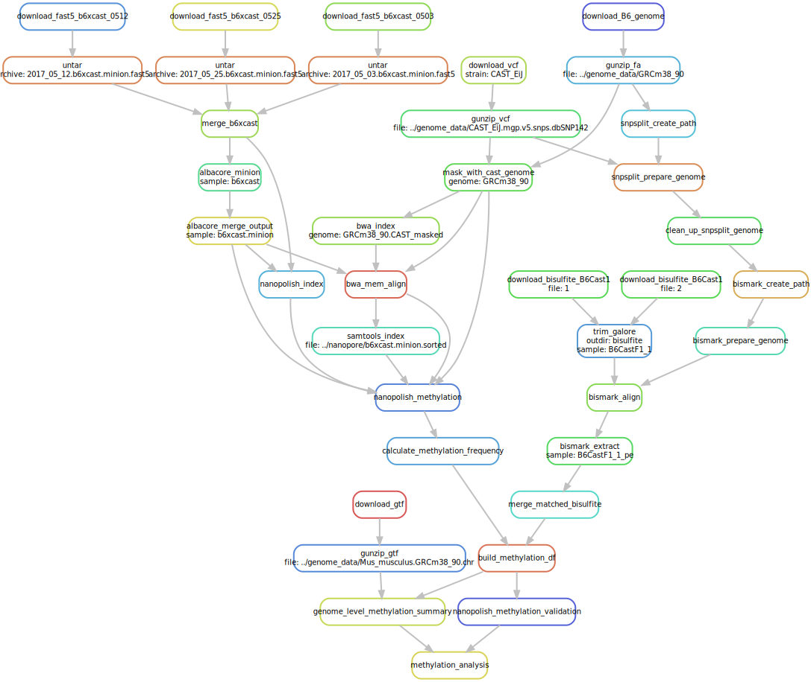
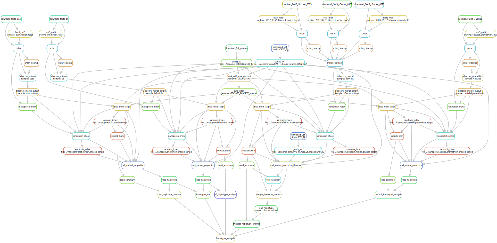
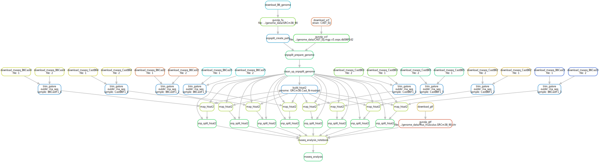

## Haplotyped Methylome

[](https://doi.org/10.1101/445924)

Reproducibility instructions for Gigante et al., 2019.

_Note: this repository is still being tested! If you find a bug, please file an issue._

Data available at [ENA Accession PRJEB27157](https://www.ebi.ac.uk/ena/data/view/PRJEB27157).

Author's note: there is an error in Figure S2 of the paper, in which the figure legend was marked Maternal/Paternal where it should have been Black6/Cast. A corrected version is available [here](https://github.com/scottgigante/haplotyped-methylome/blob/master/Figure_S2.pdf).

[](http://htmlpreview.github.io/?https://github.com/scottgigante/haplotyped-methylome/blob/master/dependency_graph.svg)

### System requirements

* R
* Python>=3.5
* Lots of RAM (min 256GB)
* Lots of disk space (estimate: 2TB)

#### Dependencies

To install with `conda`, run the following command.

```
conda env create -f environment.yml
source activate haplotyped_methylome
```

You will then need to install Albacore: it is available on the [Nanopore Community](https://community.nanoporetech.com/downloads).

To install without conda, see the list of dependencies at the bottom of this README.

### Required data

For the standard workflow, `snakemake` will download all the necessary files.

If you wish to avoid running `albacore`, `bwa` and `nanopolish` on the raw nanopore data, you can run the following command, which downloads the output of these programs and tricks `snakemake` into thinking you have run the pipeline from the beginning:

```
snakemake intermediate_download
```

_Note: the download link for these files is not yet available, but will be posted to ENA shortly._

If you wish to rerun from the beginning after running this command, you can revert to the original download with `snakemake --forceall`.

### Running the workflow

To generate all plots, tables and notebooks, simply run from the root directory:

```
snakemake --cores 16
```

If you don't wish to run the full analysis, you can run specific rules from the Snakefile by running, for example:

```
snakemake --cores 16 rnaseq_analysis
snakemake --cores 16 haplotype_analysis
snakemake --cores 16 methylation_analysis
```

### Installation without `conda`

Software dependencies:

* [SAMtools](http://www.htslib.org/download/)
* [Hisat2](https://ccb.jhu.edu/software/hisat2/index.shtml)
* [Trim Galore](https://www.bioinformatics.babraham.ac.uk/projects/trim_galore/)
* [SNPsplit](https://www.bioinformatics.babraham.ac.uk/projects/SNPsplit/)
* [Bismark](https://www.bioinformatics.babraham.ac.uk/projects/bismark/)
* [Bowtie 2](http://bowtie-bio.sourceforge.net/bowtie2/index.shtml)
* [Pandoc](https://pandoc.org/installing.html)
* [Albacore](https://community.nanoporetech.com/downloads) (optional)
* [BWA](https://sourceforge.net/projects/bio-bwa/files/) (optional)
* [Nanopolish](https://nanopolish.readthedocs.io/en/latest/installation.html) (optional)

Python package dependencies:

```
pip install --user -r requirements.txt
```

R package dependencies:

```
Rscript install_R_deps.R
```

### Known Issues

* `rnaseq_analys.Rmd` failed: `there is no package called 'ggrastr'`

If `devtools` doesn't play nicely with `conda`, sometimes the automatic GitHub installation of `ggrastr` fails. You can resolve if as follows:

```
git clone --depth 1 https://github.com/VPetukhov/ggrastr.git
cd ggrastr
R -e 'devtools::install()'
```

[](http://htmlpreview.github.io/?https://github.com/scottgigante/haplotyped-methylome/blob/master/methylation_dependency_graph.svg)

[](http://htmlpreview.github.io/?https://github.com/scottgigante/haplotyped-methylome/blob/master/haplotype_dependency_graph.svg)

[](http://htmlpreview.github.io/?https://github.com/scottgigante/haplotyped-methylome/blob/master/rnaseq_dependency_graph.svg)
