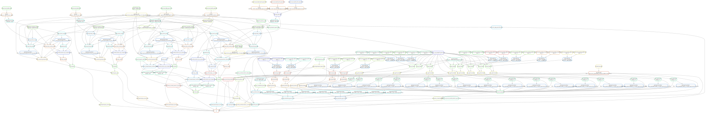

## Nanopore Allelic Methylation

Reproducibility instructions for Gigante et al., 2018.

[](http://htmlpreview.github.io/?https://github.com/scottgigante/nanopore-allelic-methylation/blob/master/dependency_graph.svg)

### System requirements

* R
* Python>=3.5

#### Dependencies

To install with `conda`, run the following command.

```
conda env create -f environment.yml
```

To install without conda, see the list of dependencies at the bottom of this README.

### Required data

For the standard workflow, we expect that you have the following directory structure (files included in this GitHub repository are omitted for brevity):

```
+── README.md
├── genome_data
|   ├──CAST_EiJ.mgp.v5.snps.dbSNP142.vcf
|   ├──FVB_NJ.mgp.v5.snps.dbSNP142.vcf
|   ├──CpG_coordinates_mm10.RData
|   ├──CGI_coordinates_mm10.masked.HMM.tsv
|   ├──Mus_musculus.GRCm38.90.chr.gtf
|   ├──ICR_plot_regions.tsv
|   └──primary_ICRs_mm10.tsv
├── bisulfite
|   ├──???
|   └──???
├── nanopore
|   ├──albacore_1.2.2.b6.sorted.bam
|   ├──albacore_1.2.2.b6.phased_sorted.bam
|   ├──albacore_1.2.2.b6.methylation.tsv
|   ├──albacore_1.2.2.cast.sorted.bam
|   ├──albacore_1.2.2.cast.phased_sorted.bam
|   ├──albacore_1.2.2.cast.methylation.tsv
|   ├──albacore_1.2.2.b6xcast.sorted.bam
|   ├──albacore_1.2.2.b6xcast.phased_sorted.bam
|   ├──albacore_1.2.2.b6xcast.methylation.tsv
|   ├──albacore_2.7.7.castxb6.promethion.sorted.bam
|   ├──albacore_2.7.7.castxb6.promethion.phased_sorted.bam
|   └──albacore_2.7.7.castxb6.promethion.methylation.tsv
├── rna_seq
|   ├──???
|   └──???
├── notebooks
└── scripts
```

If you wish to run `nanopolish` on the raw read data, you can replace the contents of `nanopore` with the following:

```
+── nanopore
    ├──albacore_1.2.2.b6.fast5/
    ├──albacore_1.2.2.b6.fa.gz
    ├──albacore_1.2.2.cast.fast5/
    ├──albacore_1.2.2.cast.fa.gz
    ├──albacore_1.2.2.b6xcast.fast5/
    ├──albacore_1.2.2.b6xcast.fa.gz
    ├──albacore_2.7.7.castxb6.promethion.fast5/
    └──albacore_2.7.7.castxb6.promethion.fa.gz
```

### Running the workflow

To generate all plots, tables and notebooks, simply run from the root directory:

```
snakemake
```

If you don't wish to run the full analysis, you can run specific rules from the Snakefile by running, for example:

```
snakemake rnaseq_analysis
```

### Installation without `conda`

Software dependencies:

* [SAMtools](http://www.htslib.org/download/)
* [BWA](https://sourceforge.net/projects/bio-bwa/files/)
* [Hisat2](https://ccb.jhu.edu/software/hisat2/index.shtml)
* [Trim Galore](https://www.bioinformatics.babraham.ac.uk/projects/trim_galore/)
* [SNPsplit](https://www.bioinformatics.babraham.ac.uk/projects/SNPsplit/)
* [Bismark](https://www.bioinformatics.babraham.ac.uk/projects/bismark/)
* [Nanopolish](https://nanopolish.readthedocs.io/en/latest/installation.html) (optional)
* [Pandoc](https://pandoc.org/installing.html)

Python package dependencies:

```
pip install --user -r requirements.txt
```

R package dependencies:

```
Rscript install_R_deps.R
```